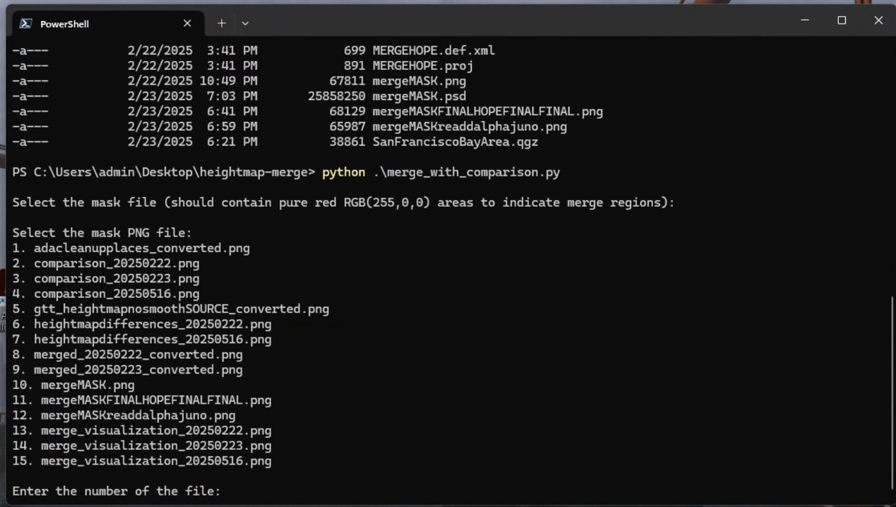

# ASC Heightmap Merger

This script merges two ASC (Arc/Info ASCII Grid) heightmap files based on a mask image. It also generates a comparison image showing the differences between the source and target heightmaps before merging, and a visualization of the merge process. ONLY TESTED ON WINDOWS 11.

## Features

*   Reads and writes ASC heightmap files.
*   Merges two heightmaps using a user-provided PNG mask.
    *   The mask should use pure red (RGB: 255,0,0) to define areas where data from the source file will be copied to the target file.
*   Generates a comparison plot:
    *   Target heightmap
    *   Source heightmap
    *   Difference map (Source - Target)
    *   Statistics of the differences (mean, std dev, min, max).
*   Generates a merge visualization plot:
    *   Target heightmap
    *   Applied mask
    *   Merged result.
*   Handles resizing of the mask image if its dimensions do not match the heightmap dimensions.
*   Interactive file selection from the command line.

## Example Outputs

Here are some example outputs generated by the script:

**Merge Visualization Plot**


**Comparison Plot**


**CLI**


## Requirements

*   Python 3
*   Libraries:
    *   NumPy
    *   Matplotlib
    *   Pillow
    *   Tkinter (usually included with standard Python installations)

You can install the required Python libraries using pip:

```bash
pip install -r requirements.txt
```

## How to Use

1.  **Prepare your files:**
    *   Ensure you have at least two `.asc` heightmap files in the same directory as the script.
    *   Ensure you have at least one `.png` mask file in the same directory. The mask file should use pure red pixels (RGB: 255,0,0) to indicate the regions to be merged from the source heightmap.
2.  **Run the script:**
    ```bash
    python merge_with_comparison.py
    ```
3.  **Follow the prompts:**
    *   The script will first ask you to select the mask PNG file.
    *   Then, it will ask you to select the target `.asc` file (the file that will be modified).
    *   Finally, it will ask you to select the source `.asc` file (the file from which data will be taken).
4.  **View the outputs:**
    *   A comparison image (`comparison_YYYYMMDD.png`) will be displayed and saved, showing the differences between the target and source heightmaps.
    *   A message box will remind you about the mask requirements (pure red for merge areas).
    *   The merged heightmap will be saved as `merged_YYYYMMDD.asc`.
    *   A final visualization of the merge process (`merge_visualization_YYYYMMDD.png`) will be displayed and saved.

## File Naming

*   Merged ASC file: `merged_YYYYMMDD.asc`
*   Comparison image: `comparison_YYYYMMDD.png`
*   Merge visualization image: `merge_visualization_YYYYMMDD.png`

(Where `YYYYMMDD` is the current date)

## Notes

*   The script assumes that the header information (ncols, nrows, xllcorner, yllcorner, cellsize, NODATA_value) of the source and target ASC files are compatible for merging, using the target file's header for the output.
*   If the mask image dimensions differ from the heightmap dimensions, the mask will be automatically resized to match the heightmap. This might affect the precision of the mask. 